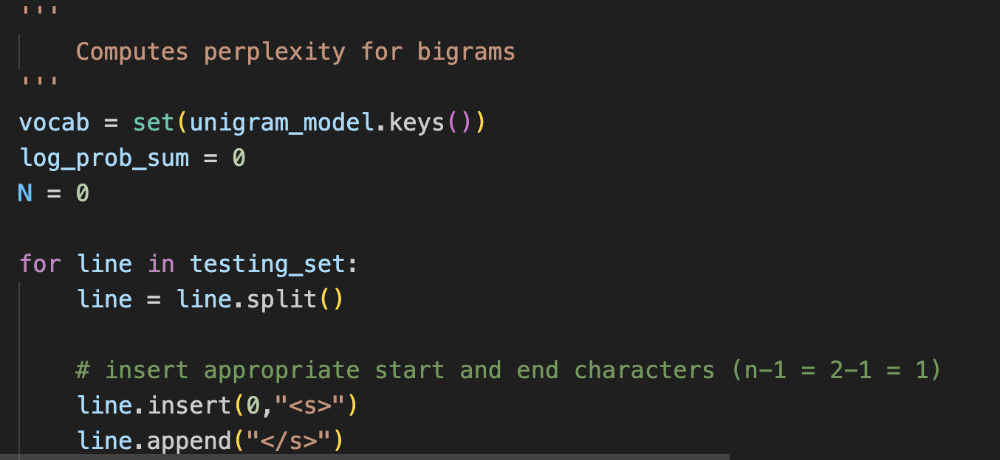
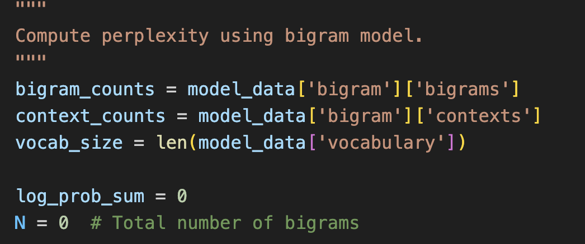
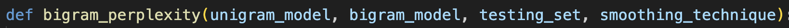
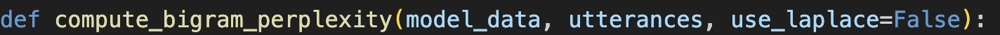
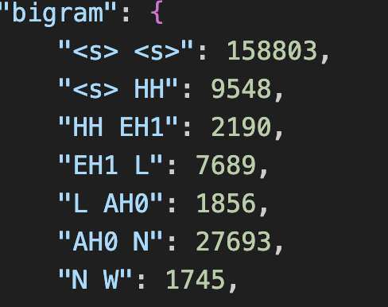
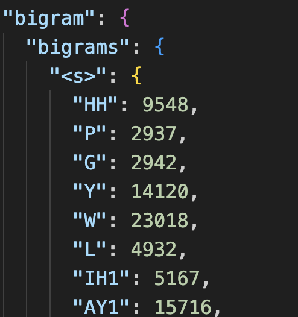
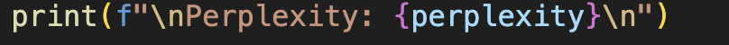
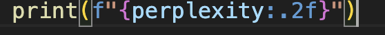

# Discuss similarities and differences in coding style

----

### Comments

**Example:**

|yours|LLM|
|---|---|
|||

**Discussion:**

```
The style of the comments are similar between Claude's code and our code. Each function begins with a multiline comment describing what the function does. And then there are one line comments next to/above lines of code explaining what is going on specifically in that line/the next few lines. This commenting practice is extremely common, which is why it makes sense that Claude comments this way. The majority of it's training data probably follows a similar commenting style to ours, and that is why Claude comments this way.
```

----

### Function declarations

**Example:**

|yours|LLM|
|---|---|
|||

**Discussion:**

```
The function declarations are similar between Claude's code and our code. Both our codes do not use type-annotations in our function declarations (meaning we do not define the type of the parameters we are passing in the function declaration nor do we define the return type in the function declaration). It is a little surprising that Claude doesn't use type-annotations, as ChatGPT does, but it suggests the majority of the training data Claude uses does not have type-annotations in function declarations.
```

----

### Organization of the JSON file

**Example:**

|yours|LLM|
|---|---|
|||

**Discussion:**

```
Our JSON files are structured a little differently. Claude's json is more complex, as it uses a nested dictionary, while ours is more simple because it uses a regular dictionary. 
```

----

### Print statements

**Example:**

|yours|LLM|
|---|---|
|||

**Discussion:**

```
Print statements follow the same style in both our code and Claude's code. They both use f-string formatting, which is probably the most standard type of print statement, which is why it makes sense that Claude's print statement follow that format, as the majority of it's training data probably follows that. 
```

----

### Presenting the perplexity results

**Example:**

|yours|LLM|
|---|---|
|||

**Discussion:**

```
Both Claude's code and our code present the perpelexity results the a simple print statement. The only difference is Claude's code limits the perplexity number to two decimal places when printing (by using .2f). This is probably the format the majority of the training data followed. 
```